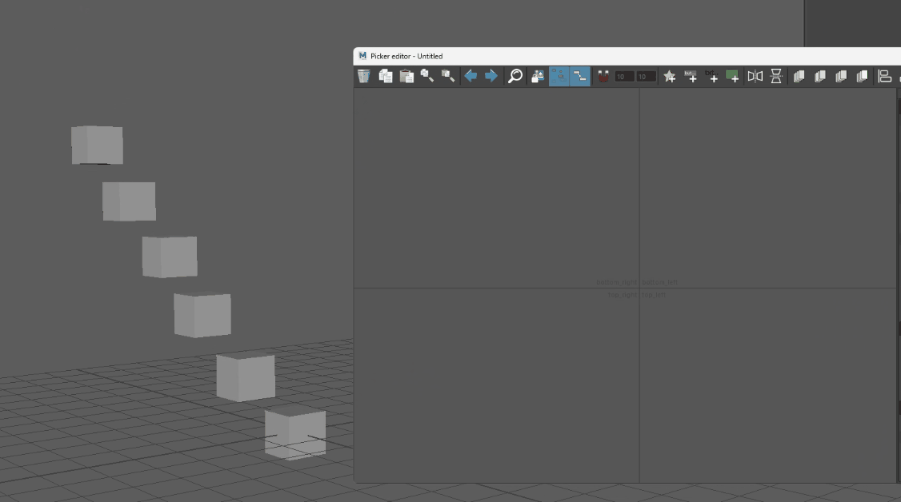
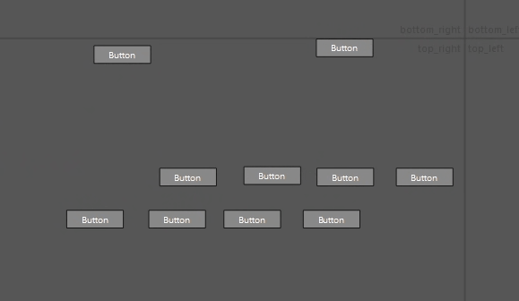
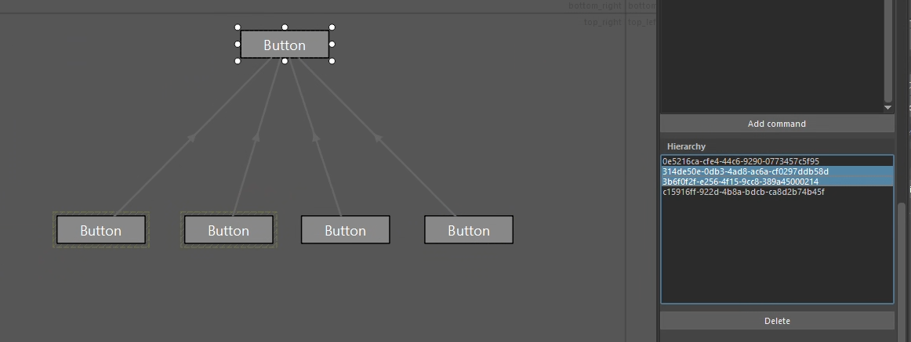
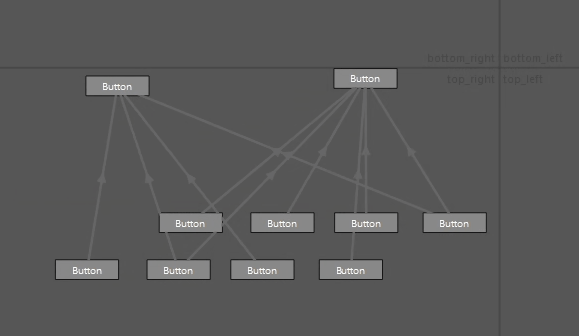

# Selection Hierarchy

You can set up a selection hierarchy. If a controller has children, double-clicking will select the shape along with all its descendants.

By default, the viewport represents the hierarchy using arrows from the child to the parent. Strange? Not really! It might be unexpected, but this is the standard way to visualize hierarchy in a schematic representation. 🤷

  

You can turn off the display of these connections from the menu **Edit** > **Toggle Hierarchy Display** or by pressing the **`Y`** shortcut.

### Multiple Shapes Creation

The most easy way to create a hierarchy is to use the function: **Add selection multiple buttons** from the picker or the **Advanced Editor**.

  

### Edit Hierarchy

To create a hierarchy from existing buttons, simply drag and drop one button onto another within the **Advanced Editor** canvas while holding the **`ALT`** key.

  

### Remove Hierarchy

You can access the list of child IDs in the **Advanced Editor**'s **Attribute Editor**, under the **Shapes** tab, in the **Action** section.
Since the IDs can be difficult to interpret, selecting one will highlight the corresponding shape. You can delete connections by clicking the Delete button.

  

If you want to massively break connections, you can use **Clear Children** on selected parent from the **Advanced Editor** right click menu.

  

