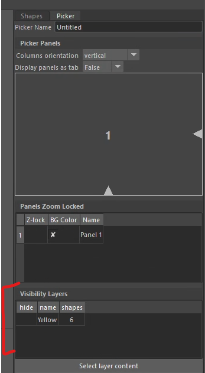
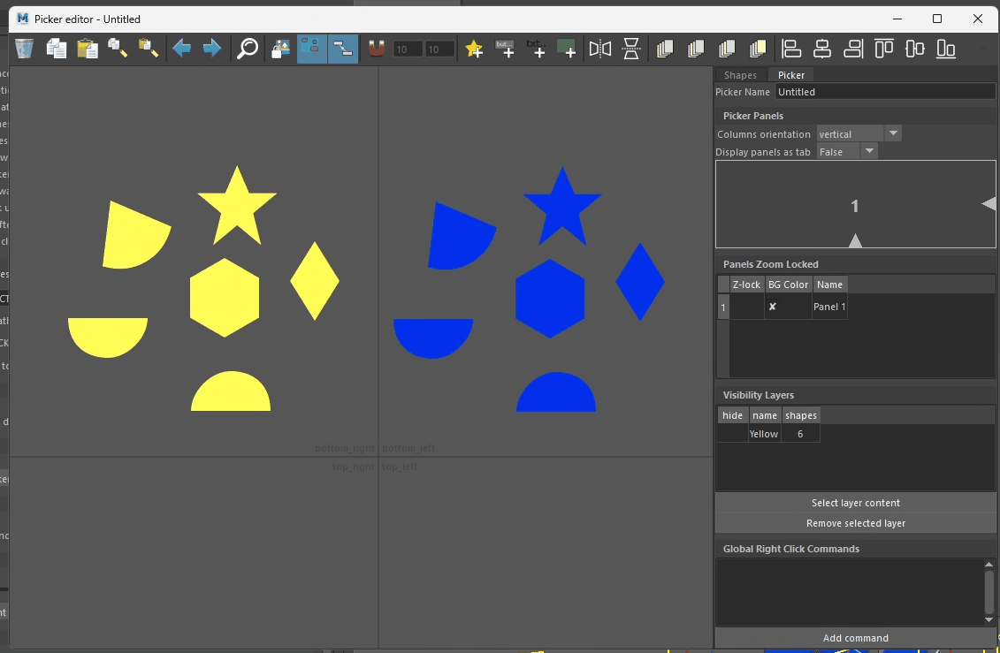
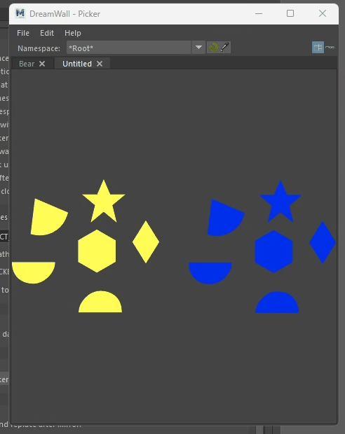
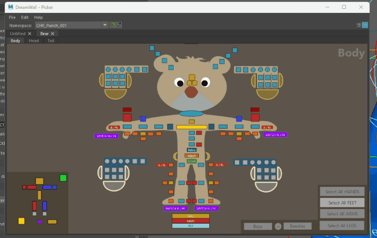

# Visibility Layers

Such as the Maya's display layers, the picker contains a system to show and hide a group of buttons.


### Create a Layer

Layers can only be created from the Advanced Editor. To create a layer:

1. Select a series of shapes.
2. Right-click and choose "Create Layer from Selection".
3. Enter a name in the dialog box.

Once created, the visibility layer will be added to the Picker tab in the right panel, under the "Visibility Layers" section.

<center></center>
<center></center>


### Switch Visibility

The picker contains a menu to select visible layer.
<center></center>


### Include Toggle Button

As it could be tidious to switch layer visibility you can add a button in the picker to toggle the visibilities.

<center></center>

To achieve this, create a script button and use this python command:
```python
import dwpicker

# Show a layer
dwpicker.set_layer_visibility("name of the layer", True)

# Hide a layer
dwpicker.set_layer_visibility("name of the layer", True)

# Toggle visibility
dwpicker.toggle_layer_visibility("name of the layer")

```