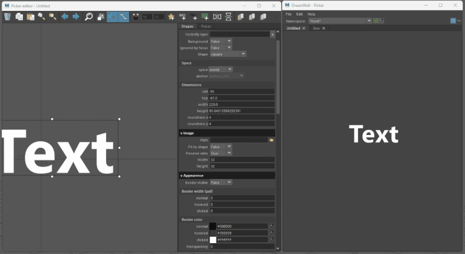

# Overlay Buttons

It is possible to create buttons that remain overlaid on top of the picker.

### Setup

Within the **Advanced Editor**'s **Attribute Editor**, navigate to the **Shapes** tab and locate the **Shape** section. Set the option to **Space to Screen**.
The anchor attributes specify the docking corner where you want to position the button relative to its container. The canvas serves as a guide to assist with placement."

> Note: Marking a shape as screen space does not affect stack evaluation. A screen space shape can be drawn behind a world space one and does not enforce an overlay.