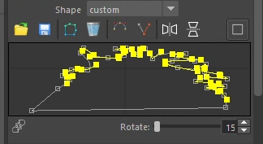
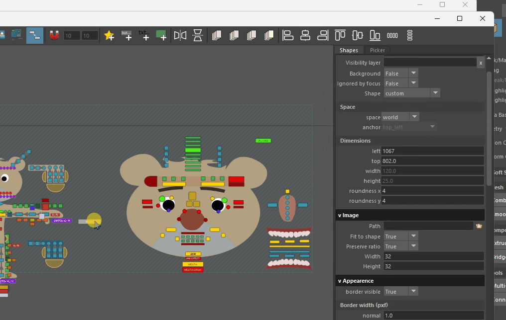
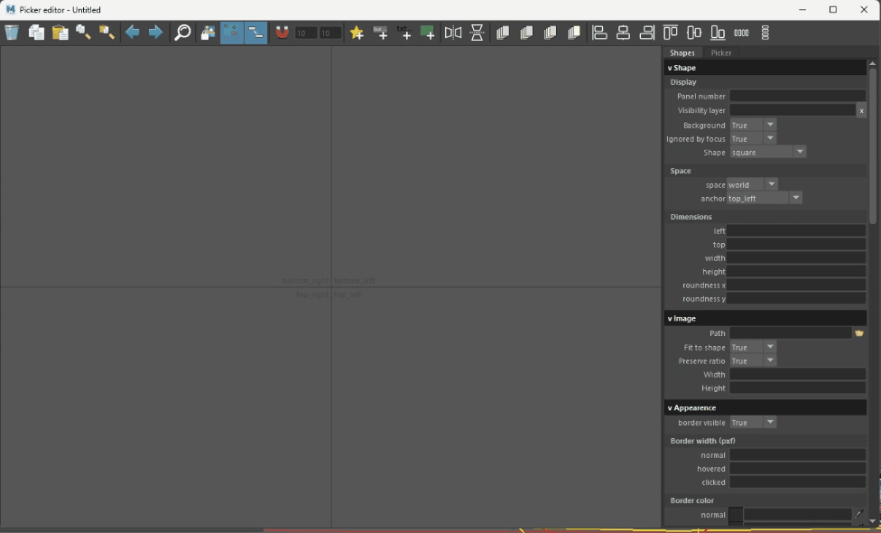

# Custom Shapes

Each button can be square, round, a rounded square, or a "custom shape." A custom shape is a unique vector-based design composed of a single shell. However, rendering custom shapes is 50 times slower than basic ones, so they should be used sparingly. Using over 1,000 custom shapes can significantly reduce FPS.

### Data

The shape is stored relative to the top-left coordinates.

### Editor

The editor appears when the "Custom" option is selected in the shape dropdown menu. You can undock the canvas from the attribute editor by clicking □.

> **Pro tip**: *ctrl + click* on tangent to manipulate it separatly.

### Library

A common shape library is available clicking on the "star +" icon of the Advanced Editor's toolbar.

