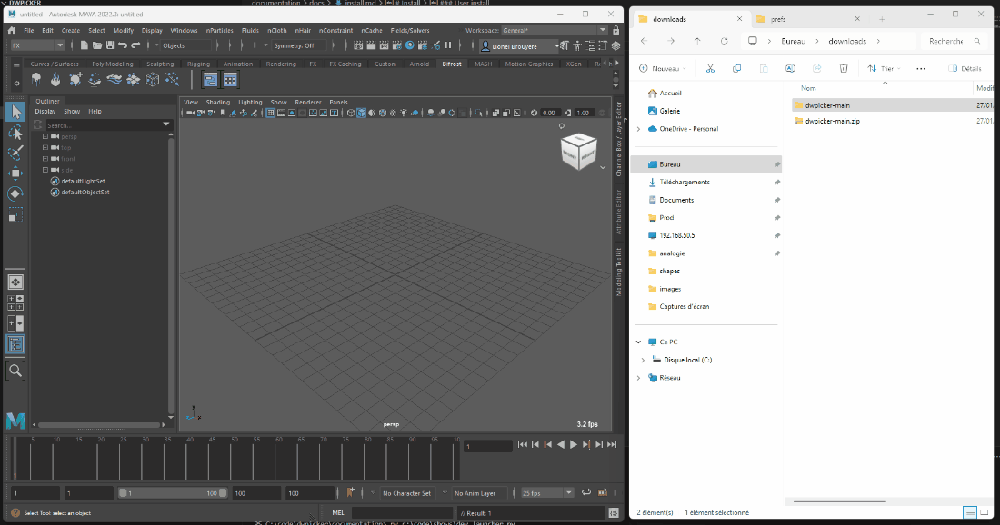

# Install

### User installation

- Unzip the dwpicker zip.
- Navigate through the dwpicker folder.
- Drag and drop the `drag_and_drop_to_maya_install.py` into maya viewport.



### Installation modes

There are two different installation modes for the script:

- Into Maya's Scripts Folder

This method copies the script into the user's script folder.

| os       | path                                                  |
| ------   | ------                                                |
| linux    | ~/<username>/maya/scripts                             |
| windows  | \Users\<username>\Documents\maya\scripts              |
| mac os x | ~<username>/Library/Preferences/Autodesk/maya/scripts |

This will generate a shelf button that uses the following startup command.

```python
import dwpicker
dwpicker.show()
```

- From the Current Folder

This method creates a button command in the selected shelf, pointing to the script's current location.

> Note: If you move the script from its current location, the shelf button will no longer work.