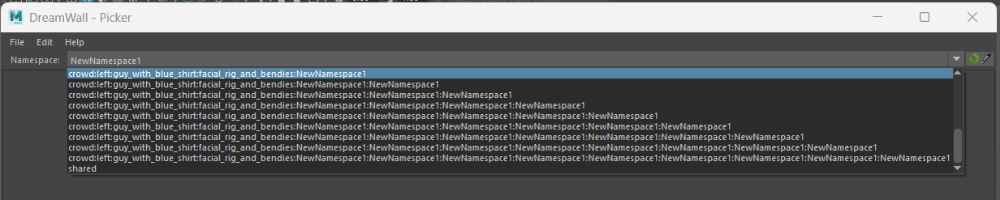

# Namespace customizations


### Customizing Namespace Listing.

By default, the picker lists all namespaces present in the scene. However, in animation projects following a standard pipeline, a scene can include numerous namespaces unrelated to animable objects, such as sets, static assets, shaders, etc.

This can be problematic for several reasons:

- Cluttered List: The namespace list becomes overwhelming due to unrelated entries.
- Nested Namespaces: Sometimes, namespaces are deeply nested and have excessively long names, making the list even harder to navigate.



Since creating a universal system that handles all contexts and pipelines effectively is unrealistic, the default namespace listing method can be bypassed.
You can pass a custom function to the `list_namespaces_function` argument of the `dwpicker.show` function. This allows you to define how namespaces are listed, tailoring the picker to better suit your specific pipeline or project needs.


```python
# Example of way to list only the namespaces starting with 'CHAR_'

from maya import cmds
import dwpicker

def list_character_namespaces() -> List[str]:
    """
    Return the items as string which will populate the namespace combo.
    """
    namespaces = cmds.namespaceInfo(listOnlyNamespaces=True, recurse=True)
    return [ns for ns in namespaces if ns.startswith('CHAR_')]


dwpicker.show(list_namespaces_function=list_character_namespaces)

```


### Manage nested namespaces.

By default, the picker is designed to operate with only one root namespace per picker. Managing nested or multiple namespaces is not supported out-of-the-box, as implementing such functionality would require imposing specific naming conventions—something many studios may not be able to accommodate.

Since the picker must remain agnostic and usable across diverse pipelines and workflows, its default behavior is intentionally kept simple.
Default Behavior:

- When switching the namespace, the picker applies the selected namespace to all targets within the picker.
- It does not distinguish between or manage nested namespaces automatically.

Many studios use setups where rigs are combined via references in a buffer file. This results in scenes with multiple nested namespaces for a single picker. In such cases, the picker may not inherently support the granularity required to handle these nested namespaces effectively.

To customize that process, you can write your own function to rename a target that picker will use: `replace_namespace_function` argument of the `dwpicker.show`.


```python

def preserve_nested_namespaces(target: str, namespace: str) -> str:
    if not root_namespace:
        return target

    if target.count(':') <= 1:
        return f'{namespace}:{target.split(':')[-1]}

    target = ':'.join(target.split(':')[1:])
    return f'{target}:{namespace}


dwpicker.show(replace_namespace_function=list_character_namespaces)
```
