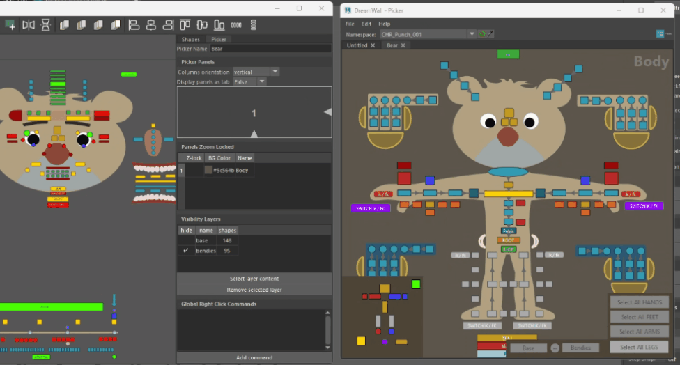
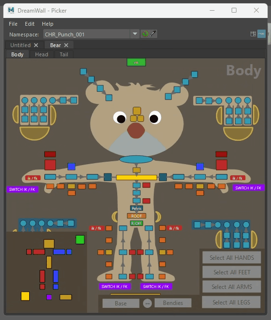
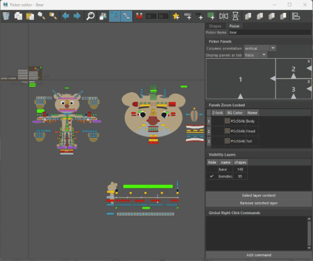
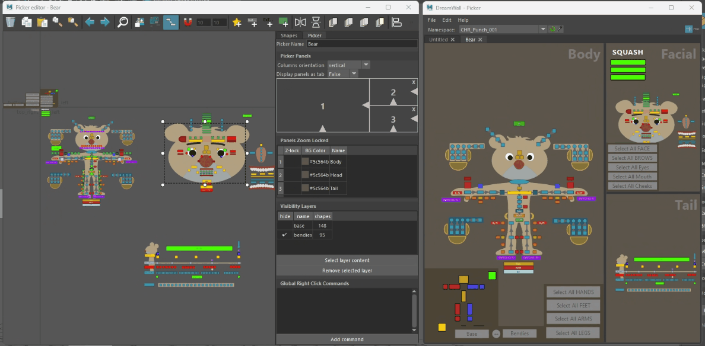

# Multiple Panels

The Multipanel feature allows you to split the **Picker** into multiple viewports. However, this change is only visible in the **Picker View**—the **Canvas** will still display all shapes as part of the same document.

Once the multipanel picker is set up, you can toggle between a split **viewport** and **sub-tabs** for display. The configuration lets you set a default view, but users can still switch between the two modes interactively.

### Setup

Setting up the panels must be done in the **Picker** tab within the **Advanced Editor**, under the **Picker Panels** section.

### Switch Display

To dynamically switch between split viewports and sub-tabs, go to **Edit** > **Toggle Panel Display** Mode or press **`T`**.

If the **Namespace Toolbar** is visible, you can also use the toggle buttons to switch modes.

### Isolate Shapes

In the **Advanced Editor**, you can isolate a panel to keep the canvas clean.

### Assign Shapes to Panel

